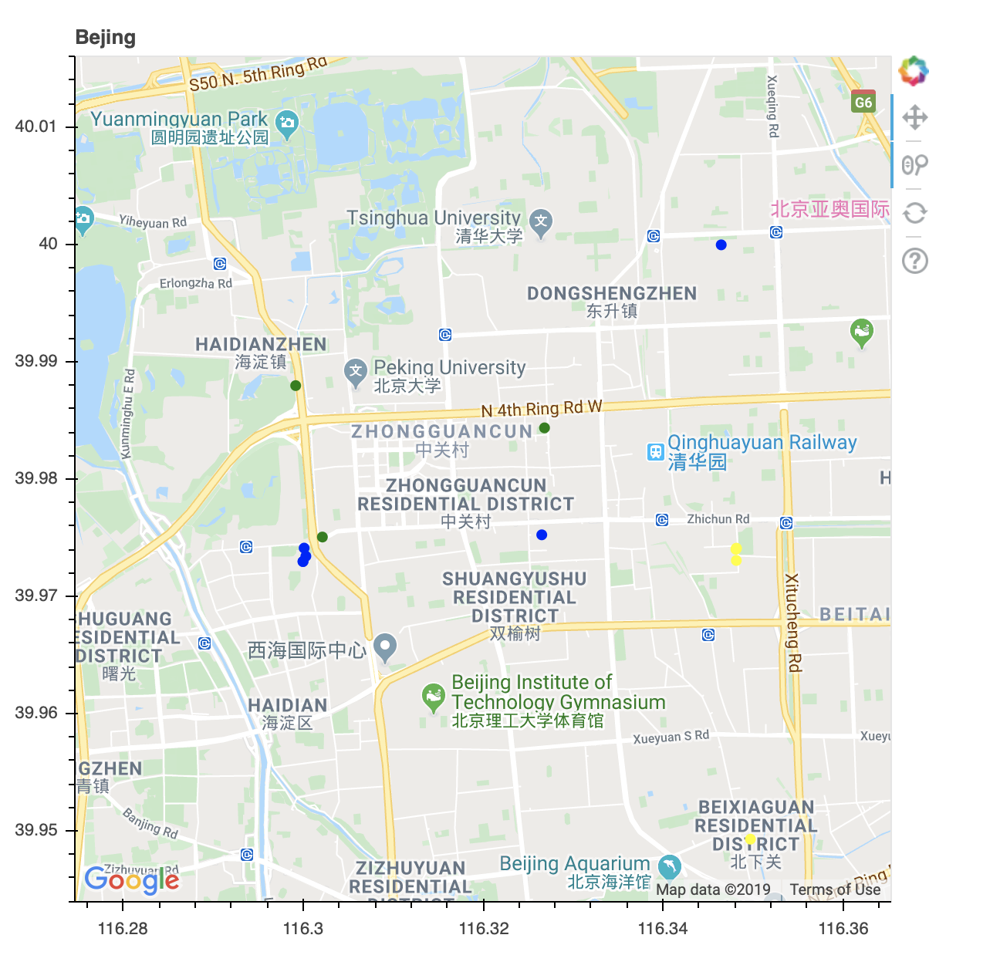
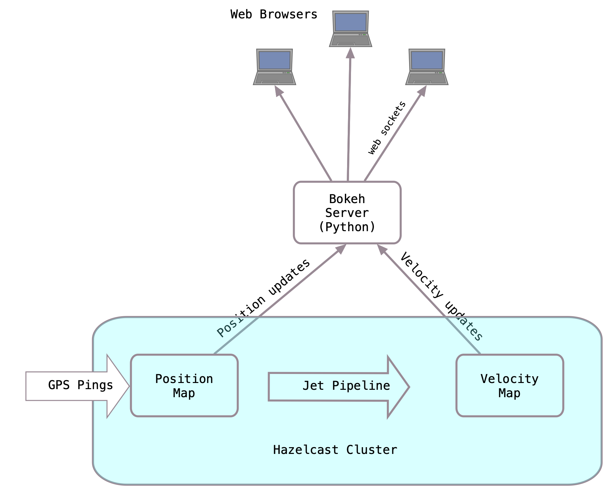

# Overview

This demo shows how the Hazelcast platform can be used to capture GPS location pings from multiple devices, display them in real time and also perform calculations on the stream in real time.  It uses GPS data from the [GeoLife data set](https://www.microsoft.com/en-us/research/project/geolife-building-social-networks-using-human-location-history/) which is provided by Microsoft.  [Bokeh server](https://docs.bokeh.org/en/latest/) is used to display the data on a map.  

The diagram below depicts the high level architecture.  GPS pings are written to a map. The Bokeh server  uses the [Hazelcast Python client](https://github.com/hazelcast/hazelcast-python-client) to register an event listener on the position map.  The map entries are JSON to facilitate interoperation with python code.  As positions come in , they are forwarded to the Bokeh server which updates the display.   A Jet pipeline consumes events from the same map.  It uses rolling windows and a custom aggregator to compute the velocity over each window.

# Contents

`categorize-velocity-jet-job`

Contains the java code defining the Jet pipeline.  Includes a custom aggregator that uses spherical trigonometry to compute the distance between coordinates given in lat/long.

`data`

Contains the GeoLife data set, `emitter.py` which plays the data into the cluster at real time speed, and `beijing.py` , which displays the color coded GPS pings.

`docker-compose.yml`

The main docker-compose configuration file.

`docker-images`

Contains build instructions for the Docker images used in the demo.

`hazelcast-config`

Hazelcast runtime configuration files used by docker-compose deployment.

`jet-server`

Source code and ".pom" file for the IMDG/Jet server.

`resources`

Demo video and images.

# Usage

Prerequisites: Maven and Docker Desktop, Google Maps API Key

Set Up:

- If you want to use the Jet Management Center, edit `docker-compose.yml` and replace JET_LICENSE_HERE with your license key. 

- If you do not have one, you will need to go to https://console.developers.google.com , enable the Google Maps API (the Maps JavaScript API in particular) and create an API key.  Edit `data/beijing.py` and replace the "Google Maps API KEY" placeholder with your API Key.

  

Build it: `mvn clean install`

Start it: `docker-compose up -d`

View log files: `docker-compose logs --follow`

Submit the Jet Job: `./submitjob.sh`

Access Management Center: [http://localhost:8080/hazelcast-mancenter](http://localhost:8080/hazelcast-mancenter)

Access the Jet Management Center: http://localhost:8081/

Access the UI: http://localhost:5006/beijing

Stop it: `docker-compose down`

